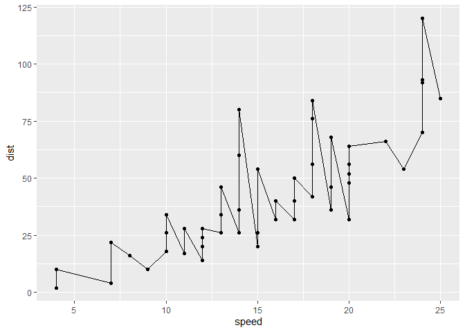
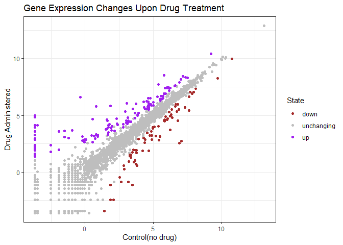

# Class05
Nicholas Thiphakhinkeo A17686679
2024-10-15

``` r
library("ggplot2")
ggplot(data=cars) +
  aes(x=speed, y=dist) +
  geom_point()
```


``` r
p <- ggplot(data=cars) +
  aes(x=speed, y=dist) +
  geom_point()
#adding scatter line
p + geom_line()
```



``` r
#adding fit line
p + geom_smooth()
```

    `geom_smooth()` using method = 'loess' and formula = 'y ~ x'


``` r
#adding linear line 
p + geom_smooth(method="lm")
```

    `geom_smooth()` using formula = 'y ~ x'


\#—————————–

``` r
url <- "https://bioboot.github.io/bimm143_S20/class-material/up_down_expression.txt"
genes <- read.delim(url)
head(genes)
```

            Gene Condition1 Condition2      State
    1      A4GNT -3.6808610 -3.4401355 unchanging
    2       AAAS  4.5479580  4.3864126 unchanging
    3      AASDH  3.7190695  3.4787276 unchanging
    4       AATF  5.0784720  5.0151916 unchanging
    5       AATK  0.4711421  0.5598642 unchanging
    6 AB015752.4 -3.6808610 -3.5921390 unchanging

``` r
#Plot and Adding Color
g <- ggplot(data=genes) +
  aes(x=Condition1, y=Condition2,
      col=State) +
  geom_point()
#Fraction of Total Genes Up-Reg(%)
table(genes$State)/nrow(genes) * 100
```


          down unchanging         up 
      1.385681  96.170131   2.444188 

``` r
#Rounding Value (last purple value sig fig amounts)
round(table(genes$State)/nrow(genes) * 100,3)
```


          down unchanging         up 
         1.386     96.170      2.444 

``` r
#Changing Color
g + scale_color_manual(values=c("brown", "gray","purple")) +
  labs(title="Gene Expression Changes Upon Drug Treatment",
       x="Control(no drug)", y="Drug Administered") +
  theme_bw()
```


