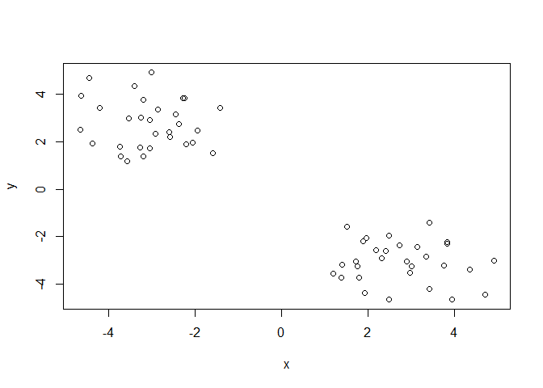

# Class07
Nicholas Thiphakhinkeo

# rnorm

``` r
rnorm(10)
```

     [1]  2.13787475  0.14091927  0.07971799  0.01561986 -0.39819577 -0.18605761
     [7] -0.10496214  2.68012052  1.36040792 -1.88766914

``` r
hist(rnorm(1000, mean=3))
```


``` r
n <- 1000
x <- c(rnorm(n,-3),rnorm(n,+3))
hist(x)
```


``` r
n<-30
x<-c(rnorm(n,-3), rnorm(n,+3))
y <- rev(x)
z <- cbind(x,y)
head(z)
```

                 x        y
    [1,] -2.850364 3.346270
    [2,] -2.056472 1.958415
    [3,] -3.392684 4.352269
    [4,] -3.532789 2.972439
    [5,] -1.575744 1.518586
    [6,] -4.192289 3.427139

``` r
plot(z)
```



``` r
km <- kmeans(z,centers=2)
km
```

    K-means clustering with 2 clusters of sizes 30, 30

    Cluster means:
              x         y
    1 -3.056927  2.759746
    2  2.759746 -3.056927

    Clustering vector:
     [1] 1 1 1 1 1 1 1 1 1 1 1 1 1 1 1 1 1 1 1 1 1 1 1 1 1 1 1 1 1 1 2 2 2 2 2 2 2 2
    [39] 2 2 2 2 2 2 2 2 2 2 2 2 2 2 2 2 2 2 2 2 2 2

    Within cluster sum of squares by cluster:
    [1] 52.71486 52.71486
     (between_SS / total_SS =  90.6 %)

    Available components:

    [1] "cluster"      "centers"      "totss"        "withinss"     "tot.withinss"
    [6] "betweenss"    "size"         "iter"         "ifault"      

``` r
km$size
```

    [1] 30 30

Cluster Assignment

``` r
km$cluster
```

     [1] 1 1 1 1 1 1 1 1 1 1 1 1 1 1 1 1 1 1 1 1 1 1 1 1 1 1 1 1 1 1 2 2 2 2 2 2 2 2
    [39] 2 2 2 2 2 2 2 2 2 2 2 2 2 2 2 2 2 2 2 2 2 2

Cluster Center

``` r
km$centers
```

              x         y
    1 -3.056927  2.759746
    2  2.759746 -3.056927

# Plot z color colored by kmeans cluster assignment and add cluster centers as blue points

R recycles shorter color vector to be the same length as the longer
(number of data points) in z

``` r
plot(z, col=c("purple","green"))
```


``` r
plot(z, col=km$cluster)
```


# use points() function to add new points to an existing plot… like a cluster plot

``` r
plot(z, col=km$cluster)
points(km$centers, col="purple", pch=15, cex=2)
```


# Q. Run kmeans and ask for 4 clusters and plot results

``` r
km2 <- kmeans(z, centers=4)
km2
```

    K-means clustering with 4 clusters of sizes 16, 14, 16, 14

    Cluster means:
              x         y
    1 -2.986099  1.952219
    2  3.682635 -3.137873
    3  1.952219 -2.986099
    4 -3.137873  3.682635

    Clustering vector:
     [1] 4 1 4 4 1 4 1 1 1 4 1 4 4 4 1 1 1 4 1 4 1 1 1 4 1 1 4 1 4 4 2 2 3 2 3 3 2 3
    [39] 3 3 2 3 2 3 3 3 2 2 2 3 2 3 3 3 2 3 2 2 3 2

    Within cluster sum of squares by cluster:
    [1] 14.60151 15.58361 14.60151 15.58361
     (between_SS / total_SS =  94.6 %)

    Available components:

    [1] "cluster"      "centers"      "totss"        "withinss"     "tot.withinss"
    [6] "betweenss"    "size"         "iter"         "ifault"      

``` r
plot(z, col=km2$cluster)
points(km2$centers, col="purple", pch=15, cex=1.5)
```


# Hierarchical Clustering

\#need distance matrix of data to be clustered

``` r
d <- dist(z)
hc<- hclust(d)
hc
```


    Call:
    hclust(d = d)

    Cluster method   : complete 
    Distance         : euclidean 
    Number of objects: 60 

``` r
plot(hc)
```


\#Cluster Membership by cutting tree with cutree()

``` r
grps <- cutree(hc,h=8)
grps
```

     [1] 1 1 1 1 1 1 1 1 1 1 1 1 1 1 1 1 1 1 1 1 1 1 1 1 1 1 1 1 1 1 2 2 2 2 2 2 2 2
    [39] 2 2 2 2 2 2 2 2 2 2 2 2 2 2 2 2 2 2 2 2 2 2

# Plot “z” colored by hclust

``` r
plot(z, col=grps)
```


# PCA Uk Foods Data

``` r
url <- "https://tinyurl.com/UK-foods"
x <- read.csv(url, row.names=1)
head(x)
```

                   England Wales Scotland N.Ireland
    Cheese             105   103      103        66
    Carcass_meat       245   227      242       267
    Other_meat         685   803      750       586
    Fish               147   160      122        93
    Fats_and_oils      193   235      184       209
    Sugars             156   175      147       139

``` r
barplot(as.matrix(x), beside=T, col=rainbow(nrow(x)))
```


``` r
pairs(x, col=rainbow(10), pch=16)
```


# Using PCA for Larger Data Sets

``` r
pca <- prcomp(t(x))
summary(pca)
```

    Importance of components:
                                PC1      PC2      PC3       PC4
    Standard deviation     324.1502 212.7478 73.87622 3.176e-14
    Proportion of Variance   0.6744   0.2905  0.03503 0.000e+00
    Cumulative Proportion    0.6744   0.9650  1.00000 1.000e+00

``` r
attributes(pca)
```

    $names
    [1] "sdev"     "rotation" "center"   "scale"    "x"       

    $class
    [1] "prcomp"

``` r
pca$x
```

                     PC1         PC2        PC3           PC4
    England   -144.99315   -2.532999 105.768945 -4.894696e-14
    Wales     -240.52915 -224.646925 -56.475555  5.700024e-13
    Scotland   -91.86934  286.081786 -44.415495 -7.460785e-13
    N.Ireland  477.39164  -58.901862  -4.877895  2.321303e-13

``` r
plot(pca$x[,1],pca$x[,2], col=c("black","red","blue","darkgreen"), pch=15, xlab="PC1 (67.4%)", ylab="PC2(29.05%)")
```


# Colored Country Plot

``` r
plot(pca$x[,1], pca$x[,2], xlab="PC1(67.4%)", ylab="PC2(29.05%)", xlim=c(-270,500))
text(pca$x[,1], pca$x[,2], colnames(x),col=c("yellow","red","blue","darkgreen"),pch=0, cex=1)
```


