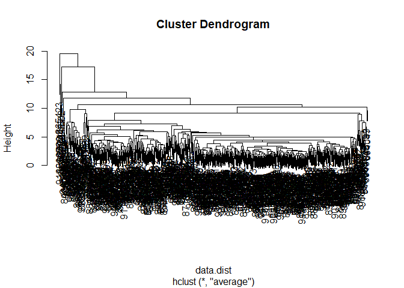

# Class08
Nicholas Thiphakhinkeo A17686679

# Save Input Data File

``` r
fna.data <- "WisconsinCancer.csv"
```

# Storing

``` r
wisc.df <- read.csv(fna.data, row.names=1)
head(wisc.df)
```

             diagnosis radius_mean texture_mean perimeter_mean area_mean
    842302           M       17.99        10.38         122.80    1001.0
    842517           M       20.57        17.77         132.90    1326.0
    84300903         M       19.69        21.25         130.00    1203.0
    84348301         M       11.42        20.38          77.58     386.1
    84358402         M       20.29        14.34         135.10    1297.0
    843786           M       12.45        15.70          82.57     477.1
             smoothness_mean compactness_mean concavity_mean concave.points_mean
    842302           0.11840          0.27760         0.3001             0.14710
    842517           0.08474          0.07864         0.0869             0.07017
    84300903         0.10960          0.15990         0.1974             0.12790
    84348301         0.14250          0.28390         0.2414             0.10520
    84358402         0.10030          0.13280         0.1980             0.10430
    843786           0.12780          0.17000         0.1578             0.08089
             symmetry_mean fractal_dimension_mean radius_se texture_se perimeter_se
    842302          0.2419                0.07871    1.0950     0.9053        8.589
    842517          0.1812                0.05667    0.5435     0.7339        3.398
    84300903        0.2069                0.05999    0.7456     0.7869        4.585
    84348301        0.2597                0.09744    0.4956     1.1560        3.445
    84358402        0.1809                0.05883    0.7572     0.7813        5.438
    843786          0.2087                0.07613    0.3345     0.8902        2.217
             area_se smoothness_se compactness_se concavity_se concave.points_se
    842302    153.40      0.006399        0.04904      0.05373           0.01587
    842517     74.08      0.005225        0.01308      0.01860           0.01340
    84300903   94.03      0.006150        0.04006      0.03832           0.02058
    84348301   27.23      0.009110        0.07458      0.05661           0.01867
    84358402   94.44      0.011490        0.02461      0.05688           0.01885
    843786     27.19      0.007510        0.03345      0.03672           0.01137
             symmetry_se fractal_dimension_se radius_worst texture_worst
    842302       0.03003             0.006193        25.38         17.33
    842517       0.01389             0.003532        24.99         23.41
    84300903     0.02250             0.004571        23.57         25.53
    84348301     0.05963             0.009208        14.91         26.50
    84358402     0.01756             0.005115        22.54         16.67
    843786       0.02165             0.005082        15.47         23.75
             perimeter_worst area_worst smoothness_worst compactness_worst
    842302            184.60     2019.0           0.1622            0.6656
    842517            158.80     1956.0           0.1238            0.1866
    84300903          152.50     1709.0           0.1444            0.4245
    84348301           98.87      567.7           0.2098            0.8663
    84358402          152.20     1575.0           0.1374            0.2050
    843786            103.40      741.6           0.1791            0.5249
             concavity_worst concave.points_worst symmetry_worst
    842302            0.7119               0.2654         0.4601
    842517            0.2416               0.1860         0.2750
    84300903          0.4504               0.2430         0.3613
    84348301          0.6869               0.2575         0.6638
    84358402          0.4000               0.1625         0.2364
    843786            0.5355               0.1741         0.3985
             fractal_dimension_worst
    842302                   0.11890
    842517                   0.08902
    84300903                 0.08758
    84348301                 0.17300
    84358402                 0.07678
    843786                   0.12440

# Remove 1st Column

``` r
wisc.data <- wisc.df[,-1]
```

# Diagnosis Vector

``` r
diagnosis <- wisc.df[,1]
head(diagnosis)
```

    [1] "M" "M" "M" "M" "M" "M"

# Benign v Malignant Count

``` r
table(diagnosis)
```

    diagnosis
      B   M 
    357 212 

# Q1. How Many Observations in this Dataset?

## 569 Observations

# Q2. How many Malignant?

## 212 Cases

# Q3. How many Variables in Data are Suffixed with ’\_mean’?

``` r
mean_check <- length(grep("_mean", colnames(wisc.data)))
mean_check
```

    [1] 10

# Checking Column Means and SD

``` r
colMeans(wisc.data)
```

                radius_mean            texture_mean          perimeter_mean 
               1.412729e+01            1.928965e+01            9.196903e+01 
                  area_mean         smoothness_mean        compactness_mean 
               6.548891e+02            9.636028e-02            1.043410e-01 
             concavity_mean     concave.points_mean           symmetry_mean 
               8.879932e-02            4.891915e-02            1.811619e-01 
     fractal_dimension_mean               radius_se              texture_se 
               6.279761e-02            4.051721e-01            1.216853e+00 
               perimeter_se                 area_se           smoothness_se 
               2.866059e+00            4.033708e+01            7.040979e-03 
             compactness_se            concavity_se       concave.points_se 
               2.547814e-02            3.189372e-02            1.179614e-02 
                symmetry_se    fractal_dimension_se            radius_worst 
               2.054230e-02            3.794904e-03            1.626919e+01 
              texture_worst         perimeter_worst              area_worst 
               2.567722e+01            1.072612e+02            8.805831e+02 
           smoothness_worst       compactness_worst         concavity_worst 
               1.323686e-01            2.542650e-01            2.721885e-01 
       concave.points_worst          symmetry_worst fractal_dimension_worst 
               1.146062e-01            2.900756e-01            8.394582e-02 

``` r
apply(wisc.data,2,sd)
```

                radius_mean            texture_mean          perimeter_mean 
               3.524049e+00            4.301036e+00            2.429898e+01 
                  area_mean         smoothness_mean        compactness_mean 
               3.519141e+02            1.406413e-02            5.281276e-02 
             concavity_mean     concave.points_mean           symmetry_mean 
               7.971981e-02            3.880284e-02            2.741428e-02 
     fractal_dimension_mean               radius_se              texture_se 
               7.060363e-03            2.773127e-01            5.516484e-01 
               perimeter_se                 area_se           smoothness_se 
               2.021855e+00            4.549101e+01            3.002518e-03 
             compactness_se            concavity_se       concave.points_se 
               1.790818e-02            3.018606e-02            6.170285e-03 
                symmetry_se    fractal_dimension_se            radius_worst 
               8.266372e-03            2.646071e-03            4.833242e+00 
              texture_worst         perimeter_worst              area_worst 
               6.146258e+00            3.360254e+01            5.693570e+02 
           smoothness_worst       compactness_worst         concavity_worst 
               2.283243e-02            1.573365e-01            2.086243e-01 
       concave.points_worst          symmetry_worst fractal_dimension_worst 
               6.573234e-02            6.186747e-02            1.806127e-02 

# PCA

``` r
wisc.pr <- prcomp(wisc.data, scale=T)
summary(wisc.pr)
```

    Importance of components:
                              PC1    PC2     PC3     PC4     PC5     PC6     PC7
    Standard deviation     3.6444 2.3857 1.67867 1.40735 1.28403 1.09880 0.82172
    Proportion of Variance 0.4427 0.1897 0.09393 0.06602 0.05496 0.04025 0.02251
    Cumulative Proportion  0.4427 0.6324 0.72636 0.79239 0.84734 0.88759 0.91010
                               PC8    PC9    PC10   PC11    PC12    PC13    PC14
    Standard deviation     0.69037 0.6457 0.59219 0.5421 0.51104 0.49128 0.39624
    Proportion of Variance 0.01589 0.0139 0.01169 0.0098 0.00871 0.00805 0.00523
    Cumulative Proportion  0.92598 0.9399 0.95157 0.9614 0.97007 0.97812 0.98335
                              PC15    PC16    PC17    PC18    PC19    PC20   PC21
    Standard deviation     0.30681 0.28260 0.24372 0.22939 0.22244 0.17652 0.1731
    Proportion of Variance 0.00314 0.00266 0.00198 0.00175 0.00165 0.00104 0.0010
    Cumulative Proportion  0.98649 0.98915 0.99113 0.99288 0.99453 0.99557 0.9966
                              PC22    PC23   PC24    PC25    PC26    PC27    PC28
    Standard deviation     0.16565 0.15602 0.1344 0.12442 0.09043 0.08307 0.03987
    Proportion of Variance 0.00091 0.00081 0.0006 0.00052 0.00027 0.00023 0.00005
    Cumulative Proportion  0.99749 0.99830 0.9989 0.99942 0.99969 0.99992 0.99997
                              PC29    PC30
    Standard deviation     0.02736 0.01153
    Proportion of Variance 0.00002 0.00000
    Cumulative Proportion  1.00000 1.00000

# Q4. What proportion of the original variance is captured by the first principal components (PC1)?

.4427

# Q5. How many principal components (PCs) are required to describe at least 70% of the original variance in the data?

Cumulative proportion exceeds 70% at PC3 (0.72636). Therefore, three
principal components (PC1, PC2, and PC3) are required to explain at
least 70% of the original variance in the data.

# Q6. How many principal components (PCs) are required to describe at least 90% of the original variance in the data?

Cumulative proportion exceeds 90% at PC7 (0.91010). Therefore, seven
principal components (PC1-PC7) are required to explain at least 90% of
the original variance in the data

# Biplot

``` r
biplot(wisc.pr)
```


# Q7. What stands out to you about this plot? Is it easy or difficult to understand? Why?

This plot is a hot mess, need to generate our own plots for better
understanding.

# Main “PC Score Plot”, “PC1vPC2 Plot”

``` r
plot(wisc.pr$x[,1], wisc.pr$x[,2], col=as.factor(diagnosis), xlab="PC1",ylab="PC2")
```


# Q8. Generating PC1 and PC3 Plot

``` r
plot(wisc.pr$x[,1], wisc.pr$x[,3], col=as.factor(diagnosis), xlab="PC1",ylab="PC3")
```


This plot is not as clearly separated as PC1 vs PC2

# Creating Data.Frame for ggplot

``` r
df <- as.data.frame(wisc.pr$x)
df$diagnosis <- diagnosis
```

# Making Scatterplot using ggplot2

``` r
library(ggplot2)
ggplot(df) +
  aes(PC1,PC2, col=df$diagnosis) +
  geom_point()
```

    Warning: Use of `df$diagnosis` is discouraged.
    ℹ Use `diagnosis` instead.


# Calculating Variance of Each Component

``` r
pr.var <- wisc.pr$sdev
head(pr.var)
```

    [1] 3.644394 2.385656 1.678675 1.407352 1.284029 1.098798

# Variance Explained by Each Principal Component: pve

``` r
pr.var <- wisc.pr$sdev^2
pve <- pr.var/sum(pr.var)
pve
```

     [1] 4.427203e-01 1.897118e-01 9.393163e-02 6.602135e-02 5.495768e-02
     [6] 4.024522e-02 2.250734e-02 1.588724e-02 1.389649e-02 1.168978e-02
    [11] 9.797190e-03 8.705379e-03 8.045250e-03 5.233657e-03 3.137832e-03
    [16] 2.662093e-03 1.979968e-03 1.753959e-03 1.649253e-03 1.038647e-03
    [21] 9.990965e-04 9.146468e-04 8.113613e-04 6.018336e-04 5.160424e-04
    [26] 2.725880e-04 2.300155e-04 5.297793e-05 2.496010e-05 4.434827e-06

``` r
plot(pve, xlab = "Principal Component", 
     ylab = "Proportion of Variance Explained", 
     ylim = c(0, 1), type = "o")
```


# Alternative Scree Plot of Same Data

``` r
barplot(pve, ylab = "Precent of Variance Explained",
     names.arg=paste0("PC",1:length(pve)), las=2, axes = FALSE)
axis(2, at=pve, labels=round(pve,2)*100 )
```


# Q9. For the first principal component, what is the component of the loading vector (i.e. wisc.pr\$rotation\[,1\]) for the feature concave.points_mean?

``` r
loadings <- wisc.pr$rotation[, 1]
concave_points_loading <- loadings[names(wisc.data) == "concave.points_mean"]
head(concave_points_loading)
```

    concave.points_mean 
             -0.2608538 

# Q10. What is the minimum number of principal components required to explain 80% of the variance of the data?

Cumulative proportion exceeds 80% at PC5 (0.84734). Therefore, seven
principal components (PC1-PC5) are required to explain at least 80% of
the original variance in the data.

# Hierarchical Clustering

# Scale Function

``` r
data.scaled <- scale(wisc.data)
data.dist <- dist(data.scaled)
wisc.hclust <- hclust(data.dist, method="complete")
plot(wisc.hclust)
```


# Q11. Using the plot() and abline() functions, what is the height at which the clustering model has 4 clusters?

``` r
plot(wisc.hclust)
abline(h = 19, col="red",lty = 2)
```


h = 19

# Selecting Number of Clusters

``` r
wisc.hclust.clusters <- cutree(wisc.hclust, h = 19)
table(wisc.hclust.clusters, diagnosis)
```

                        diagnosis
    wisc.hclust.clusters   B   M
                       1  12 165
                       2   2   5
                       3 343  40
                       4   0   2

# Q12. find a better cluster vs diagnoses match by cutting into a different number of clusters between 2 and 10?

``` r
wisc.hclust.clusters2 <- cutree(wisc.hclust, k=2)
table(wisc.hclust.clusters2, diagnosis)
```

                         diagnosis
    wisc.hclust.clusters2   B   M
                        1 357 210
                        2   0   2

``` r
wisc.hclust.clusters10 <- cutree(wisc.hclust, k=10)
table(wisc.hclust.clusters10, diagnosis)
```

                          diagnosis
    wisc.hclust.clusters10   B   M
                        1   12  86
                        2    0  59
                        3    0   3
                        4  331  39
                        5    0  20
                        6    2   0
                        7   12   0
                        8    0   2
                        9    0   2
                        10   0   1

# Combining PCA and Clustering

``` r
d <- dist(wisc.pr$x[,1:3])
hc <-hclust(d, method="ward.D2")
plot(hc)
```


# Cutree into 2 groups/branches

``` r
grps <- cutree(hc,k=2)
```

``` r
plot(wisc.pr$x, col=grps)
```


# Q13. Which method gives your favorite results for the same data.dist dataset? Explain your reasoning.

My favorite is ward.d2 it produces the cleanest and most balanced
clustering.

Single

``` r
wist.single.clust <- hclust(data.dist, method="single")
plot(wist.single.clust)
```


Average

``` r
wist.average.clust <- hclust(data.dist, method="average")
plot(wist.average.clust)
```



Ward.D2

``` r
wist.D2.clust <- hclust(data.dist, method="ward.D2")
plot(wist.D2.clust)
```


