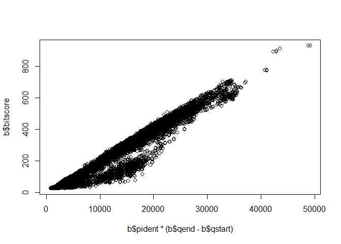
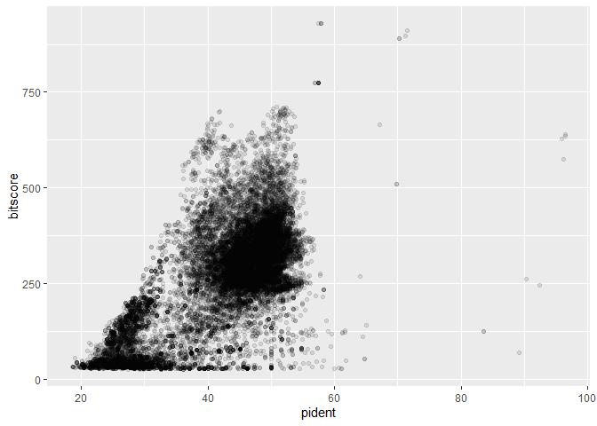
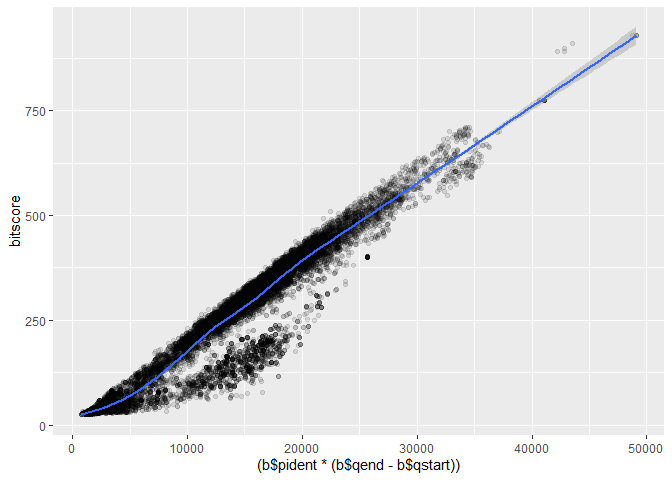

# Class16
Nicholas Thiphakhinkeo A17686679

> Q. What does the star character accomplish here? Ask Barry, or your
> class neighbor, if you are not sure!

a powerful tool in shell commands to match multiple files or directories
based on a pattern, in this case the .faa.gz

> Q. How many sequences are in this mouse.1.protein.faa file? Hint: Try
> using grep to figure this out…

> Q. What happens if you run the above command without the \>
> mm-first.fa part?

If you run the command without the \> mm-first.fa part, the first 11
lines of the mouse.1.protein.faa file will be printed directly to your
terminal.

> Q. What happens if you were to use two ‘\>’ symbols (i.e. \>\>
> mm-first.fa)?

Adds the new output to the end of the existing file.

# Reading Table

``` r
b <- read.table("myresults.tsv", sep="\t", header=TRUE)
head(data)
```

                                                                                
    1 function (..., list = character(), package = NULL, lib.loc = NULL,        
    2     verbose = getOption("verbose"), envir = .GlobalEnv, overwrite = TRUE) 
    3 {                                                                         
    4     fileExt <- function(x) {                                              
    5         db <- grepl("\\\\.[^.]+\\\\.(gz|bz2|xz)$", x)                     
    6         ans <- sub(".*\\\\.", "", x)                                      

# Setting Colnames

``` r
colnames(b) <- c("qseqid", "sseqid", "pident", "length", "mismatch", "gapopen", "qstart", "qend", "sstart", "send", "evalue", "bitscore")
```

# Plot() Function

``` r
plot(b$pident  * (b$qend - b$qstart), b$bitscore)
```



# GGPlot

``` r
library(ggplot2)
ggplot(b, aes(pident, bitscore)) + geom_point(alpha=0.1) 
```



``` r
ggplot(b, aes((b$pident * (b$qend - b$qstart)), bitscore)) + geom_point(alpha=0.1) + geom_smooth()
```

    Warning: Use of `b$pident` is discouraged.
    ℹ Use `pident` instead.

    Warning: Use of `b$qend` is discouraged.
    ℹ Use `qend` instead.

    Warning: Use of `b$qstart` is discouraged.
    ℹ Use `qstart` instead.

    Warning: Use of `b$pident` is discouraged.
    ℹ Use `pident` instead.

    Warning: Use of `b$qend` is discouraged.
    ℹ Use `qend` instead.

    Warning: Use of `b$qstart` is discouraged.
    ℹ Use `qstart` instead.

    `geom_smooth()` using method = 'gam' and formula = 'y ~ s(x, bs = "cs")'


